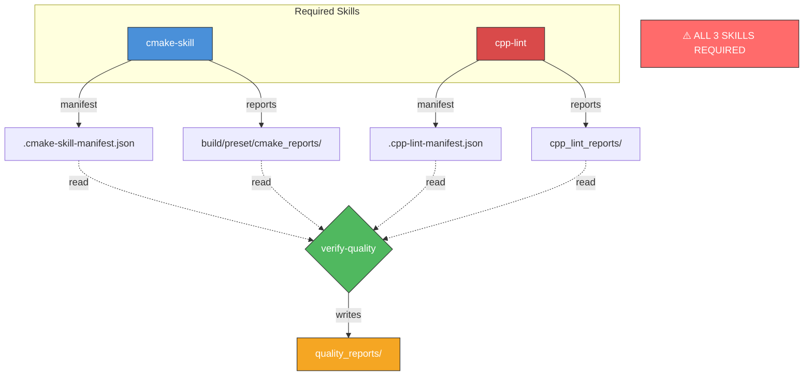

# verify-quality 🤖 [AI Agent Skill]

**Unified Quality Gate for CMake + C++ Projects.**

`verify-quality` aggregates reports from `cmake-skill` and `cpp-lint` into a consolidated quality report. It does **not** execute other skills—run them first, then use this to consolidate results.

## 🌟 Key Features

- **Report Aggregation**: Reads outputs from cmake-skill and cpp-lint
- **Manifest Discovery**: Uses `.cmake-skill-manifest.json` and `.cpp-lint-manifest.json` to locate reports
- **Consolidated Output**: All diagnostics merged into `quality_reports/quality_gate_report.md`

## 🔗 Dependency Diagram



**If cmake-skill or cpp-lint is missing:**
- verify-quality will report "No Report Data Found"
- quality_reports/ will be empty or incomplete

## 🛠 Installation

**All three skills must be installed to `~/.agents/skills/`:**

```bash
# Install all three skills (REQUIRED)
git clone https://github.com/hiono/cmake-skill ~/.agents/skills/cmake-skill
git clone https://github.com/hiono/cpp-lint ~/.agents/skills/cpp-lint
git clone https://github.com/hiono/verify-quality ~/.agents/skills/verify-quality
```

Installing only `verify-quality` without the other two skills will not work.

## 📖 Usage

```bash
# 1. Run cmake-skill first
cmake-skill pipeline --preset linux-release

# 2. Run cpp-lint next
cpp-lint changed

# 3. Aggregate results
./scripts/verify-quality .
```

## 📁 Output

Reports are written to `quality_reports/`:
- `quality_gate_report.md` - Consolidated report
- `cmake_report.json` - CMake diagnostics (copied)
- `lint_report.json` - C++ lint diagnostics (copied)

---

Maintained by **hiono**. Version **v0.1.2**.
